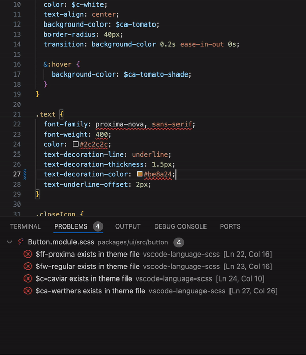

# vscode-language-scss

IntelliSense, Diagnostics, and Code Actions for SCSS files

## Theming

### Design Tokens File

The design token file should be a valid SCSS file containing variables that define your design tokens:

```scss
// src/styles/_theme.scss

$color-primary: #3498db;
$color-secondary: #2ecc71;
$fontsize-4: 24px;
$spacing-3: 16px;
```

If you would import this theme into other files like this:

```scss
@use "src/styles/theme" as *;
```

Provide the path `src/styles/theme` to the extension settings for theme path.

```json
// .vscode/settings.json
{
  "vscode-language-scss.experimental.themeDiagnosticsFile": "src/styles/theme"
}
```

You can provide multiple paths if sharing the scss files in a monorepo. When passing an array, the extension will find the first path it can resolve to a file.

### Error Diagnostics

When a value in an SCSS file matches the value of a design token, the extension will highlight the value and provide an error diagnostic. Use Quick Fix to replace highlighted values with the scss variables values.

```scss
.button {
  // error: $color-primary exists in theme file
  // fix: replace with theme value
  background-color: #3498db;

  // error: $spacing-3 exists in theme file
  // fix: replace with theme value
  padding: 16px;
}
```

Simple mixins that have depth of one have code actions when each line in a mixin is found in a class. Use Quick Fix to replace lines of scss with supported mixins.

```scss
// src/styles/_theme.scss

$color-primary: #3498db;
$fontsize-4: 24px;

@mixin page-title {
  color: $color-primary;
  font-size: $fontsize-4;
}

// src/Home.module.scss

// error: fs-text exists in theme file
// fix: replace lines with mixin
.title {
  margin: 24px;
  padding: 24px;
  color: $color-primary;
  font-size: $fontsize-4;
}
```

### Theming Example


